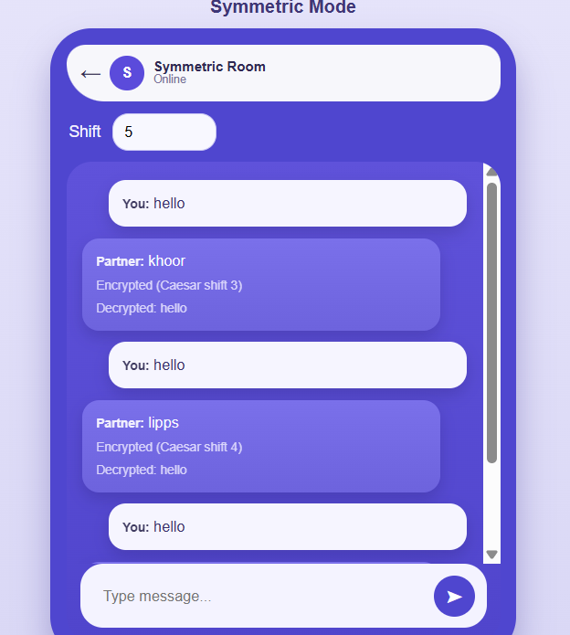
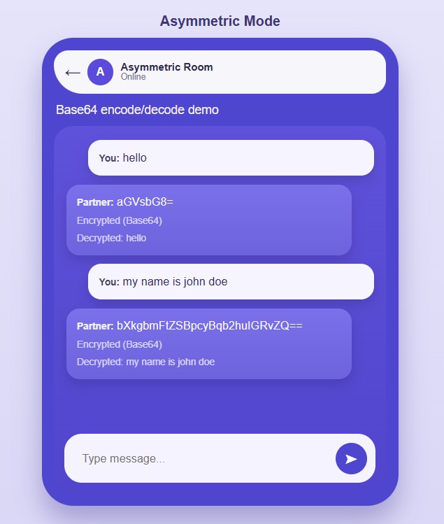

# Cryptography Chat Demo

A simple web-based chat application demonstrating basic cryptography concepts with symmetric (Caesar cipher) and asymmetric (Base64 encoding) encryption modes.

## Features

- **Symmetric Encryption**: Caesar cipher with configurable shift key
- **Asymmetric Demo**: Base64 encoding/decoding
- **Real-time Display**: Shows original, encrypted, and decrypted messages
- **Mode Switching**: Toggle between encryption methods

## Usage

1. **Select Mode**:
   - Choose "Symmetric (Caesar)" for Caesar cipher encryption
   - Choose "Asymmetric (Base64 Demo)" for Base64 encoding

2. **For Symmetric Mode**:
   - Set a shift key (1-25, default is 3)
   - Type a message and click "Send"
   - Observe the encrypted and decrypted versions

3. **For Asymmetric Mode**:
   - Type a message and click "Send"
   - Observe the Base64 encoded and decoded versions

## Testing the Demo

### Symmetric Encryption Test
- Set shift key to 3
- Send messages like "HELLO WORLD"
- Verify that encryption shifts letters and decryption restores them

### Asymmetric Demo Test
- Send messages
- Note that Base64 is encoding, not true encryption
- Same process for encode/decode

## Security Notes

- **Caesar Cipher**: Very basic encryption, easily breakable
- **Base64**: Not encryption, just text encoding for data transmission
- This is for educational purposes only

## Technologies Used

- HTML5
- CSS3
- Vanilla JavaScript

## Browser Support

Works in all modern browsers that support ES6 features.